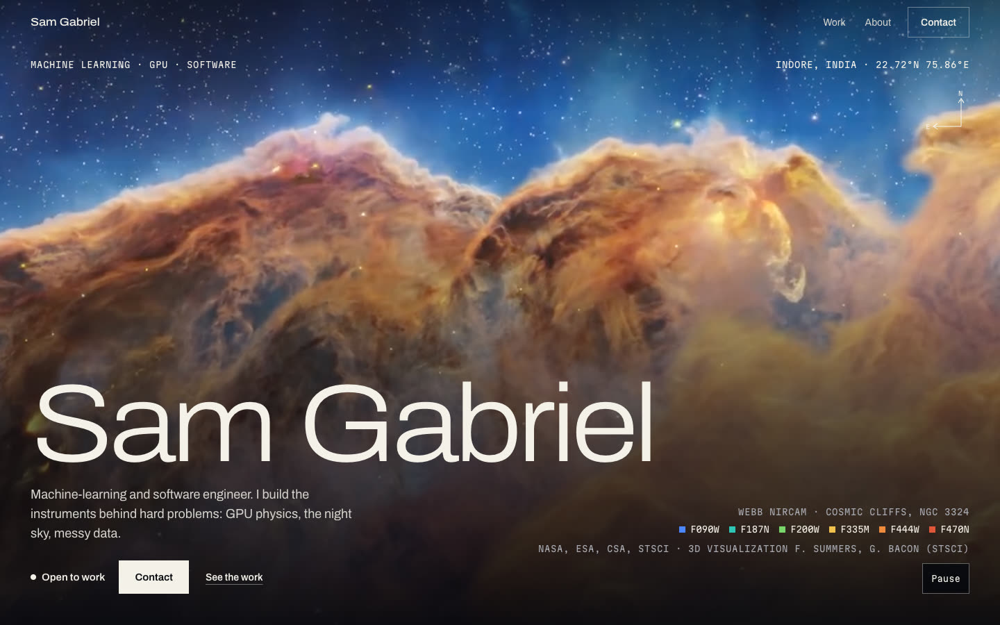
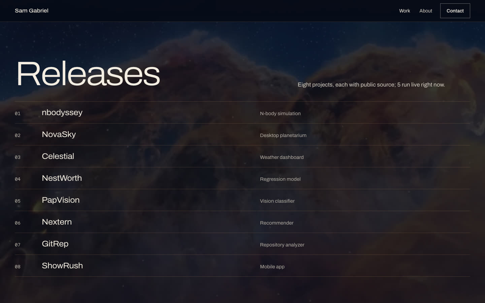

# Sam Gabriel

A single-page portfolio for Sam Gabriel, a machine-learning and software engineer in
Indore, India. Each project is presented like a telescope image release: the image, a
caption, what it was built with, and where to see it.

**Live at [samgabriel.vercel.app](https://samgabriel.vercel.app)**.



The opening image is a 3D flight through the James Webb Space Telescope's Cosmic Cliffs.
Its credit and filter legend sit with the other image credits at the foot of the page.

## The work

Eight projects with public source, five of them live. An index at the top of the section
works as a table of contents. Below it, each project gets a plate with a capture of the thing running,
because a reader cannot clone and build a CUDA simulator to see whether it works.



The one performance figure on the site is nbodyssey's: the Barnes-Hut tree code ran
176 times faster than brute force at one million particles on a single Tesla T4. It is
the only benchmark quoted and it is not rounded.

## Sections

| Section | What it holds |
| --- | --- |
| Opening | Name, role, status, and the Cosmic Cliffs flight |
| Releases | An index of all eight projects, then a plate for each with its links |
| About | Toolkit, education and work history |
| Contact | A form that drafts an email, plus the address, GitHub and LinkedIn |
| Footer | Every image credit, including the Webb filter legend |

## Space imagery

All of it is real and credited on the page:

- Cosmic Cliffs 3D flight: NASA, ESA, CSA, STScI (F. Summers, G. Bacon)

That one image carries the whole page. The opening loop plays full-bleed; below it the same
frame sits fixed behind every section, dimmed so text stays readable, drifting slowly as you
scroll and lifting again at Contact. The palette (space blue ground, cliff-dust gold accent)
is sampled from it.

The opening loop is a short segment from the NASA Scientific Visualization Studio, re-encoded
for the web. Loops only load once they are on screen, never load with reduced motion or on a
data-saver or 2G/3G connection, and every loop has a pause control. With reduced motion the
backdrop holds still.

## Running it

```bash
npm install
npm run dev
```

Then open `http://localhost:3000`.

## Building

```bash
npm run build
```

`next.config.ts` sets `output: "export"` and `images: { unoptimized: true }`, so the build
writes a fully static site to `./out` with no server behind it. That is why the contact
form drafts a `mailto:` message instead of posting anywhere, and why the email address and
social links stay visible as a fallback.

## Deploying

Vercel builds and serves `samgabriel.vercel.app` on every push to `main`. That is the
only host.

## Stack

Next.js 16 App Router, React 19, TypeScript, Tailwind CSS v4. Archivo and Martian Mono
through `next/font`. No runtime server, no database, no analytics.

## Design and product notes

[`DESIGN.md`](DESIGN.md) records the design system. [`PRODUCT.md`](PRODUCT.md) records who
the site is for and the constraints that follow. Read both before changing anything visual.

## Licence

Code is MIT. See [LICENSE](LICENSE). The space imagery belongs to its credited sources.
